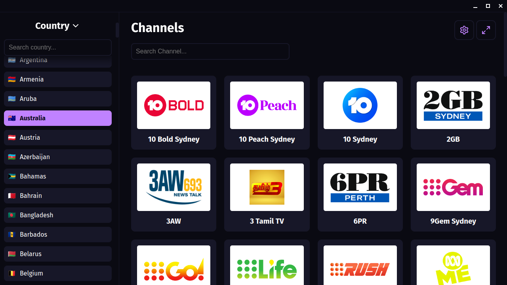
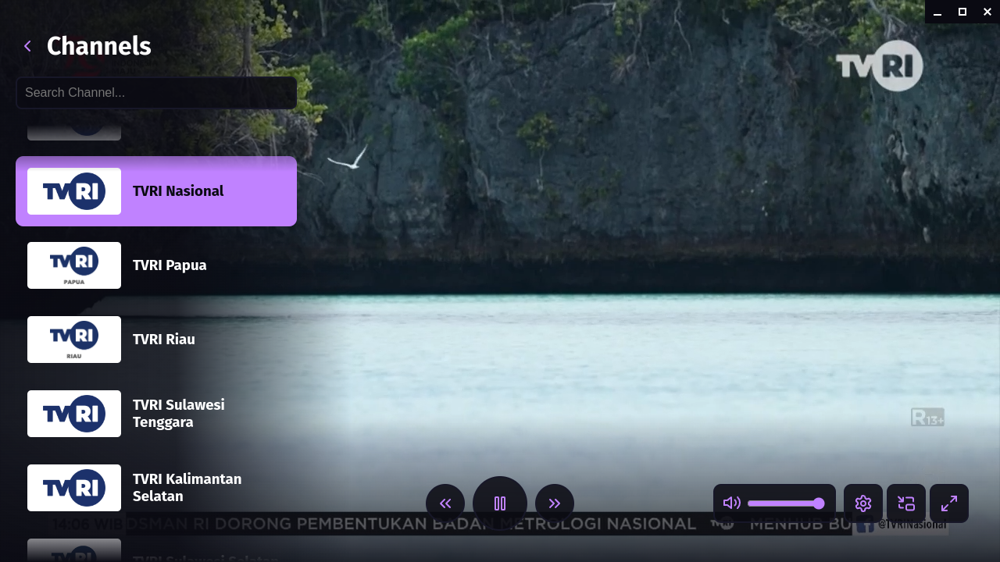

# IPTV Desktop

IPTV Desktop is application for playing IPTV from [iptv-org](https://github.com/iptv-org/iptv) playlist. Support listing channel from [iptv-org api](https://github.com/iptv-org/api) by Country, Category, and Language.

## Preview

### Channel List Screen:

### Watch Screen:

## Features

- List Channels By Country, Category, and Language.
- Caching stream and channel data.
- Use Custom DNS Over HTTPS Server.
- Caption / Subtitle Support.

## Installation

Currently we only provide binary for Linux and Windows in our [release page](https://github.com/iptv-app/iptv-desktop/releases).

## Development

This application is build with electron, lit, and hls.js. You can developing or building application locally by cloning this repository and installing package dependency using pnpm.

## Disclaimer

This repository doesn't store any video, playlist, or streaming url. This repository use [public api from iptv-org](https://github.com/iptv-org/iptv).
